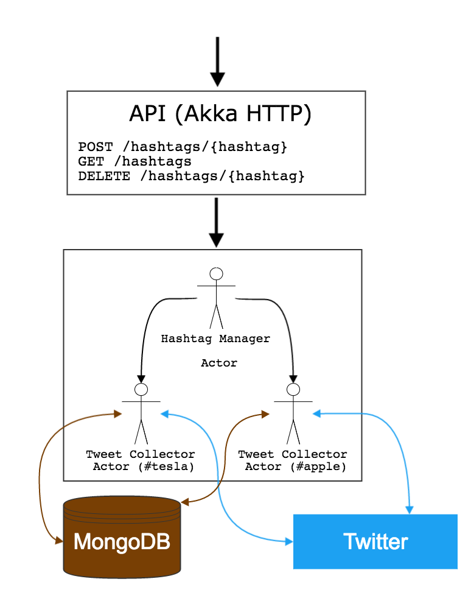

# Microservice

This repository contains a simple microservice, that uses Akka HTTP and actors.

This example was created to perform live coding during [Hack Your Career](https://www.facebook.com/Hack.your.Career) student workshops.

## Overview

This service consists of:
- an API, that uses Akka-HTTP
	- `POST /hashtags/{hashtag}` - follows a new hashtag
	- `GET /hashtags` - returns a list of hashtags being followed
	- `DELETE /hashtags/{hashtag}` - removes a hashtag from being followed
	
- an actor system, that models core logic
	- HashtagManagerActor - it spawns a new child (TweetCollectorActor) for each hashtag
	- TweetCollectorActor - it follows a certain tag and persists tweets with it in MongoDB  



## Prerequisites

1. Install [sbt](http://www.scala-sbt.org/download.html).
1. Install and run [MongoDB](https://www.mongodb.com/download-center).
1. [Create an app](https://apps.twitter.com/) on Twitter and prepare the following credentials: 
	- API key 
	- API secret 
	- Access Token 
	- Access Token Secret

## How to run it?


1. `git clone` this repo.
1. Export your Twitter credentials.

	``` bash
	export TWITTER_CONSUMER_KEY=...
	export TWITTER_CONSUMER_SECRET=...
	export TWITTER_ACCESS_TOKEN=62483804-...
	export TWITTER_ACCESS_TOKEN_SECRET=...
	```

1. `sbt run`
